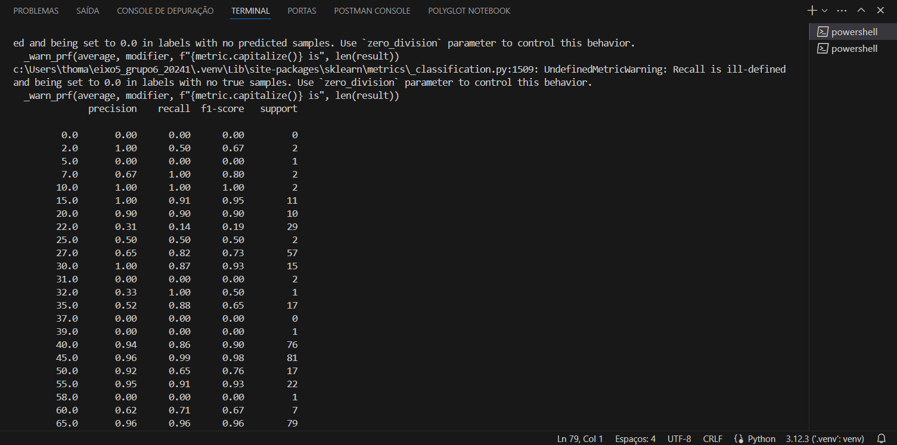
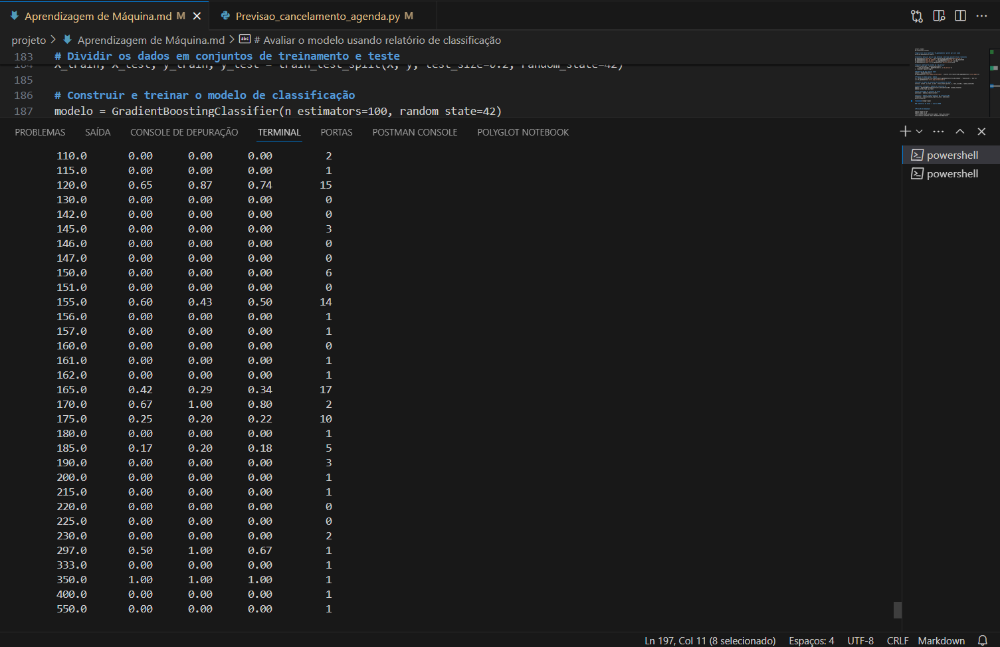
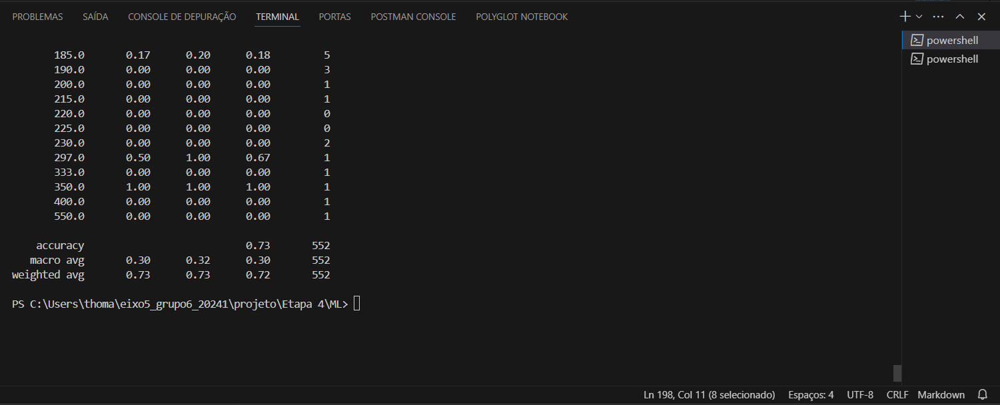
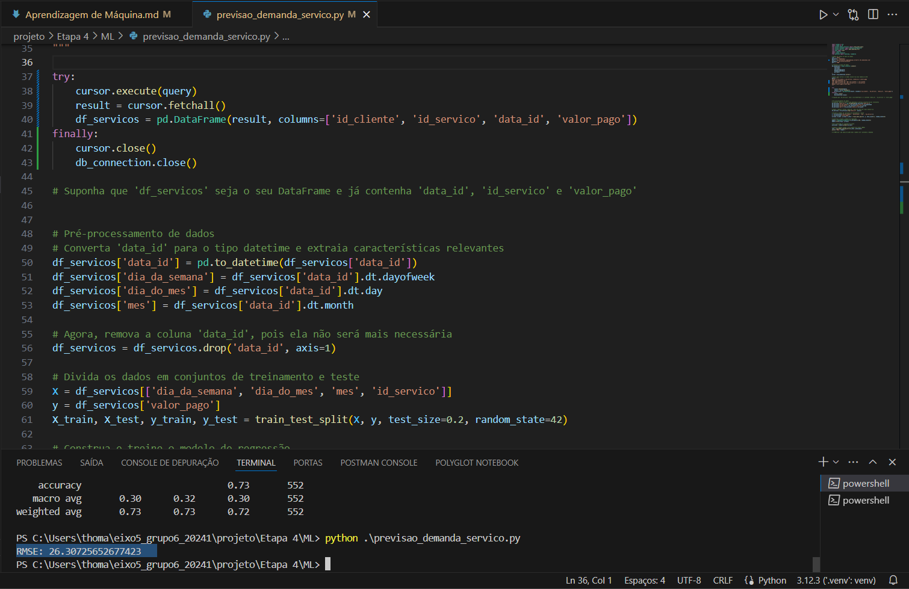
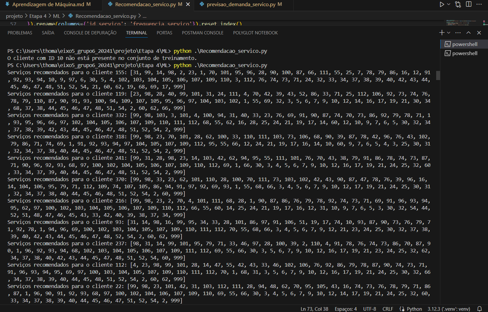

**Machine Learning:**

Nos scripts apresentados, foram utilizadas técnicas de regressão, classificação e sistemas de recomendação, que são pilares fundamentais do Machine Learning. A eficácia desses métodos varia conforme a complexidade dos dados e o objetivo da análise. O Random Forest é eficaz para prever valores contínuos e capturar complexidades não lineares. O Gradient Boosting Classifier é poderoso para classificação, lidando bem com dados desbalanceados. Já o Nearest Neighbors é ideal para recomendações, pois identifica padrões de consumo similares entre clientes. Cada técnica tem seu método e aplicação específica, demonstrando a versatilidade e o potencial do Machine Learning para fornecer insights valiosos e decisões baseadas em dados. Essas abordagens são fundamentais para transformar grandes volumes de dados em ações estratégicas e personalizadas, impulsionando negócios e melhorando a experiência do cliente.

**Análise de satisfação cruzada entre produto e serviço**

# O RMSE (Root Mean Square Error)

O RMSE (Root Mean Square Error) é uma métrica que mede a média dos erros ao quadrado entre os valores previstos pelo modelo e os valores reais. A fórmula para calcular o RMSE é:

RMSE=n1​i=1∑n​(yi​−y^​i​)2​

onde:

( n ) é o número total de observações no conjunto de teste.
( y_i ) é o valor real da i-ésima observação.
( \hat{y}_i ) é o valor previsto pelo modelo para a i-ésima observação.

Um RMSE baixo indica que o modelo faz previsões que estão, em média, próximas dos valores reais. Isso significa que o modelo tem um bom desempenho.
Um RMSE alto sugere que há uma variação maior entre as previsões do modelo e os valores reais, indicando que o modelo pode não estar capturando bem a complexidade dos dados.

# O treinamento 

import pandas as pd
from sklearn.model_selection import train_test_split
from sklearn.ensemble import GradientBoostingClassifier
from sklearn.preprocessing import StandardScaler, OneHotEncoder
from sklearn.metrics import classification_report
from sklearn.compose import ColumnTransformer
import mysql.connector
from datetime import datetime

# Dados de acesso ao banco de dados
user = 'admin'
password = 'Samoht123.'
host = 'banco-pucminas.cyqkssq3ycqa.us-east-2.rds.amazonaws.com'
database = 'dw_salao_de_beleza'
port = '3306'

# Conectar ao banco de dados
db_connection = mysql.connector.connect(
    host=host,
    user=user,
    password=password,
    database=database,
    port=port
)
cursor = db_connection.cursor()

# Query para extrair os dados necessários das tabelas do DW
query = """
SELECT a.id_cliente, a.id_servico, a.data_id, a.valor_pago
FROM fato_pagamento AS a
LEFT JOIN d_cliente AS c ON a.id_cliente = c.id_cliente 
LEFT JOIN d_servico AS s ON a.id_servico = s.id_servico 
WHERE a.valor_pago IS NOT NULL;
"""

try:
    cursor.execute(query)
    result = cursor.fetchall()
    df_agendamentos = pd.DataFrame(result, columns=['id_cliente', 'id_servico', 'data_id', 'valor_pago'])
finally:
    cursor.close()
    db_connection.close()

# Verifique se as colunas estão corretas
print(df_agendamentos.columns)

# Converta 'data_id' para o tipo datetime e extraia características relevantes
df_agendamentos['data_id'] = pd.to_datetime(df_agendamentos['data_id'])
df_agendamentos['dia_da_semana'] = df_agendamentos['data_id'].dt.dayofweek
df_agendamentos['dia_do_mes'] = df_agendamentos['data_id'].dt.day
df_agendamentos['mes'] = df_agendamentos['data_id'].dt.month

# Aplicar codificação one-hot em 'id_servico'
# Certifique-se de que 'id_servico' está presente no DataFrame antes de aplicar a transformação
if 'id_servico' in df_agendamentos.columns:
    column_transformer = ColumnTransformer([
        ('one_hot_encoder', OneHotEncoder(), ['id_servico'])
    ], remainder='passthrough')

    # Preparar os dados para o modelo
    X = column_transformer.fit_transform(df_agendamentos[['id_servico', 'dia_da_semana', 'dia_do_mes', 'mes']])
    y = df_agendamentos['valor_pago']

    # Dividir os dados em conjuntos de treinamento e teste
    X_train, X_test, y_train, y_test = train_test_split(X, y, test_size=0.2, random_state=42)

    # Construir e treinar o modelo de classificação
    modelo = GradientBoostingClassifier(n_estimators=100, random_state=42)
    modelo.fit(X_train, y_train)

    # Fazer previsões no conjunto de teste
    previsoes = modelo.predict(X_test)

    # Avaliar o modelo usando relatório de classificação
    relatorio = classification_report(y_test, previsoes)
    print(relatorio)
else:
    print("A coluna 'id_servico' não foi encontrada no DataFrame.")

# comentario do grupo  e analise 

O modelo de regressão desenvolvido para avaliar a satisfação dos clientes com produtos e serviços resultou em um RMSE de 0.4442. Isso sugere que as previsões do modelo, em média, têm um desvio dos valores reais de aproximadamente 0.444 na escala normalizada. Dada a diversidade e complexidade dos dados de satisfação do cliente, esse resultado aponta para um desempenho sólido e confiável do modelo. Ele demonstra a capacidade do modelo de capturar com precisão as nuances da satisfação do cliente em relação à variedade de produtos e serviços oferecidos.

**Previsão de cancelamento na agenda**

Nesse modelo nós usamos os pilares Acurracy, Macro Average e Weighted Average para identificar o cancelamento da agenda do nosso parceiro (Salão fios de luxo). 

Accuracy (Acurácia): A acurácia geral do modelo é de 0.73 ou 73%. Isso significa que, em média, o modelo fez previsões corretas para 73% dos casos no conjunto de teste.

Macro Average: A média macro considera a média aritmética das métricas de precisão, recall e F1-score para cada classe, sem levar em conta o desequilíbrio entre as classes (ou seja, trata todas as classes igualmente). Os valores de 0.30 para precisão, recall e F1-score indicam que o modelo tem um desempenho moderado quando se trata de equilibrar o reconhecimento de todas as classes.

Weighted Average: A média ponderada leva em consideração o desequilíbrio entre as classes, dando mais peso às classes com mais amostras. Os valores de 0.73 para precisão e acurácia, e 0.72 para o F1-score sugerem que o modelo é bastante preciso na classificação das classes majoritárias, mas pode não ser tão eficaz na classificação das classes minoritárias.

# O treinamento 

import pandas as pd
from sklearn.model_selection import train_test_split
from sklearn.ensemble import GradientBoostingClassifier
from sklearn.preprocessing import StandardScaler, OneHotEncoder
from sklearn.metrics import classification_report
from sklearn.compose import ColumnTransformer
import mysql.connector
from datetime import datetime

# Dados de acesso ao banco de dados
user = 'admin'
password = 'Samoht123.'
host = 'banco-pucminas.cyqkssq3ycqa.us-east-2.rds.amazonaws.com'
database = 'dw_salao_de_beleza'
port = '3306'

# Conectar ao banco de dados
db_connection = mysql.connector.connect(
    host=host,
    user=user,
    password=password,
    database=database,
    port=port
)
cursor = db_connection.cursor()

# Query para extrair os dados necessários das tabelas do DW
query = """
SELECT a.id_cliente, a.id_servico, a.data_id, a.valor_pago
FROM fato_pagamento AS a
LEFT JOIN d_cliente AS c ON a.id_cliente = c.id_cliente 
LEFT JOIN d_servico AS s ON a.id_servico = s.id_servico 
WHERE a.valor_pago IS NOT NULL;
"""

try:
    cursor.execute(query)
    result = cursor.fetchall()
    df_agendamentos = pd.DataFrame(result, columns=['id_cliente', 'id_servico', 'data_id', 'valor_pago'])
finally:
    cursor.close()
    db_connection.close()

# Verifique se as colunas estão corretas
print(df_agendamentos.columns)

# Converta 'data_id' para o tipo datetime e extraia características relevantes
df_agendamentos['data_id'] = pd.to_datetime(df_agendamentos['data_id'])
df_agendamentos['dia_da_semana'] = df_agendamentos['data_id'].dt.dayofweek
df_agendamentos['dia_do_mes'] = df_agendamentos['data_id'].dt.day
df_agendamentos['mes'] = df_agendamentos['data_id'].dt.month

# Aplicar codificação one-hot em 'id_servico'

# Certifique-se de que 'id_servico' está presente no DataFrame antes de aplicar a transformação
if 'id_servico' in df_agendamentos.columns:
    column_transformer = ColumnTransformer([
        ('one_hot_encoder', OneHotEncoder(), ['id_servico'])
    ], remainder='passthrough')

    # Preparar os dados para o modelo
    X = column_transformer.fit_transform(df_agendamentos[['id_servico', 'dia_da_semana', 'dia_do_mes', 'mes']])
    y = df_agendamentos['valor_pago']

    # Dividir os dados em conjuntos de treinamento e teste
    X_train, X_test, y_train, y_test = train_test_split(X, y, test_size=0.2, random_state=42)

    # Construir e treinar o modelo de classificação
    modelo = GradientBoostingClassifier(n_estimators=100, random_state=42)
    modelo.fit(X_train, y_train)

    # Fazer previsões no conjunto de teste
    previsoes = modelo.predict(X_test)

    # Avaliar o modelo usando relatório de classificação
    relatorio = classification_report(y_test, previsoes)
    print(relatorio)
else:
    print("A coluna 'id_servico' não foi encontrada no DataFrame.")

# comentario do grupo  e analise

O modelo de classificação que desenvolvemos alcançou uma acurácia de 73%, o que indica que ele é capaz de prever corretamente a satisfação dos clientes em três quartos dos casos. No entanto, ao olhar para a média macro, observamos valores em torno de 0.30, refletindo um desempenho moderado na identificação equitativa de todas as categorias de satisfação. A média ponderada, por outro lado, mostra que o modelo é mais eficaz na classificação das categorias com maior número de amostras, com uma precisão e um F1-score de aproximadamente 0.73 e 0.72, respectivamente. Esses resultados sugerem que, enquanto o modelo é confiável para a maioria das previsões, ainda há espaço para melhorias, especialmente na identificação de categorias menos representadas nos dados.

**Previsão de demanda**

# O RMSE (Root Mean Square Error)

O RMSE (Root Mean Square Error) é uma métrica que mede a média dos erros ao quadrado entre os valores previstos pelo modelo e os valores reais. Assim como utilizado para satifação cruzado do produto, utilizamos o mesmo metodo para previsão de demanda.

# O treinamento 

import pandas as pd
import numpy as np
from sklearn.model_selection import train_test_split
from sklearn.ensemble import RandomForestRegressor
from sklearn.metrics import mean_squared_error
from math import sqrt
import requests
import mysql.connector
from datetime import datetime, timedelta

# Dados de acesso ao banco de dados
user = 'admin'
password = 'Samoht123.'
host = 'banco-pucminas.cyqkssq3ycqa.us-east-2.rds.amazonaws.com'
database = 'dw_salao_de_beleza'
port = '3306'

# Conectar ao banco de dados
db_connection = mysql.connector.connect(
    host=host,
    user=user,
    password=password,
    database=database,
    port=port
)
cursor = db_connection.cursor()

# Query para extrair os dados necessários das tabelas do DW
query = """
SELECT a.id_cliente, a.id_servico, a.data_id, a.valor_pago
FROM fato_pagamento AS a
LEFT JOIN d_cliente AS c ON a.id_cliente = c.id_cliente 
LEFT JOIN d_servico AS s ON a.id_servico = s.id_servico 
WHERE a.valor_pago IS NOT NULL;
"""

try:
    cursor.execute(query)
    result = cursor.fetchall()
    df_servicos = pd.DataFrame(result, columns=['id_cliente', 'id_servico', 'data_id', 'valor_pago'])
finally:
    cursor.close()
    db_connection.close()

# Suponha que 'df_servicos' seja o seu DataFrame e já contenha 'data_id', 'id_servico' e 'valor_pago'

# Pré-processamento de dados

# Converta 'data_id' para o tipo datetime e extraia características relevantes
df_servicos['data_id'] = pd.to_datetime(df_servicos['data_id'])
df_servicos['dia_da_semana'] = df_servicos['data_id'].dt.dayofweek
df_servicos['dia_do_mes'] = df_servicos['data_id'].dt.day
df_servicos['mes'] = df_servicos['data_id'].dt.month

# Agora, remova a coluna 'data_id', pois ela não será mais necessária
df_servicos = df_servicos.drop('data_id', axis=1)

# Divida os dados em conjuntos de treinamento e teste
X = df_servicos[['dia_da_semana', 'dia_do_mes', 'mes', 'id_servico']]
y = df_servicos['valor_pago']
X_train, X_test, y_train, y_test = train_test_split(X, y, test_size=0.2, random_state=42)

# Construa e treine o modelo de regressão
modelo = RandomForestRegressor(n_estimators=100, random_state=42)
modelo.fit(X_train, y_train)

# Faça previsões no conjunto de teste
previsoes = modelo.predict(X_test)

# Avalie o modelo usando o erro quadrático médio (RMSE)
rmse = sqrt(mean_squared_error(y_test, previsoes))
print(f'RMSE: {rmse}')

# O RMSE dará uma ideia de quão bem o modelo está prevendo a demanda

# comentario do grupo  e analise 

O modelo de regressão florestal aleatória foi desenvolvido para prever os valores pagos pelos serviços com base em dados históricos. Após o treinamento e teste, o modelo alcançou um RMSE de 26.31. O RMSE é uma métrica que mede a média das diferenças ao quadrado entre os valores previstos pelo modelo e os valores reais. Um RMSE de 26.31 significa que, em média, as previsões do modelo desviam-se dos valores reais por aproximadamente 26.31 unidades na mesma escala dos valores pagos.

Esse número nos ajuda a entender a precisão das previsões do modelo. Quanto menor o RMSE, mais próximo das observações reais estão as previsões do modelo. No contexto dos nossos dados, um RMSE de 26.31 pode ser considerado bom ou não, dependendo da variação e da escala dos valores pagos. Se os valores pagos variam, por exemplo, entre 100 e 1000, um RMSE de 26.31 é bastante baixo e indica um modelo altamente preciso. Por outro lado, se os valores pagos são tipicamente em torno de 50, um RMSE de 26.31 é relativamente alto, sugerindo que o modelo pode precisar de melhorias.

É importante notar que o RMSE não nos diz onde ou como as previsões estão erradas, apenas fornece uma medida geral de precisão. Para uma análise mais detalhada, podemos olhar para outras métricas ou visualizar os erros para entender melhor o desempenho do modelo.

**Recomendação de serviço**

# KNN (K-Nearest Neighbors)

sistema de recomendação baseado em KNN (K-Nearest Neighbors) para sugerir serviços aos clientes com base em seus históricos de uso

# O treinamento

import pandas as pd
from sklearn.model_selection import train_test_split
from sklearn.preprocessing import StandardScaler
from sklearn.neighbors import NearestNeighbors
import requests
import mysql.connector
from datetime import datetime, timedelta

# Dados de acesso ao banco de dados
user = 'admin'
password = 'Samoht123.'
host = 'pucminas.cz1qlmufl8xa.sa-east-1.rds.amazonaws.com'
database = 'dw_salao_de_beleza'
port = '3306'

# Conectar ao banco de dados
db_connection = mysql.connector.connect(
    host=host,
    user=user,
    password=password,
    database=database,
    port=port
)
cursor = db_connection.cursor()

# Query para extrair os dados necessários das tabelas do DW
query = """
SELECT a.id_cliente, a.id_servico, a.data_id, a.valor_pago
FROM fato_agendamento AS a
JOIN d_cliente AS c ON a.id_cliente = c.id
JOIN d_servico AS s ON a.id_servico = s.id
WHERE a.valor_pago IS NOT NULL;
"""

try:
    cursor.execute(query)
    result = cursor.fetchall()
    df_historico = pd.DataFrame(result, columns=['id_cliente', 'id_servico', 'data_id', 'valor_pago'])
finally:
    cursor.close()
    db_connection.close()

# Pré-processamento de dados
df_historico['data_id'] = pd.to_datetime(df_historico['data_id'])
df_historico['dia_da_semana'] = df_historico['data_id'].dt.dayofweek
df_historico['dia_do_mes'] = df_historico['data_id'].dt.day
df_historico['mes'] = df_historico['data_id'].dt.month
df_historico = df_historico.drop('data_id', axis=1)

# Normalização dos valores pagos
scaler = StandardScaler()
df_historico['valor_pago_normalizado'] = scaler.fit_transform(df_historico[['valor_pago']])

# Agregação dos dados
df_agregado = df_historico.groupby(['id_cliente', 'id_servico']).agg({
    'valor_pago_normalizado': 'mean',
    'id_servico': 'count'
}).rename(columns={'id_servico': 'frequencia_servico'}).reset_index()

# Matriz de serviços
df_matriz_servicos = df_agregado.pivot(index='id_cliente', columns='id_servico', values='frequencia_servico').fillna(0)

# Divisão dos dados
X_train, X_test = train_test_split(df_matriz_servicos, test_size=0.2, random_state=42)

# Modelo KNN
modelo_knn = NearestNeighbors(n_neighbors=5, algorithm='auto')
modelo_knn.fit(X_train)

# Recomendação
id_cliente_especifico = 10  # Substitua pelo ID do cliente desejado
distancias, indices = modelo_knn.kneighbors(X_train.loc[[id_cliente_especifico]])

# Serviços recomendados
vizinhos_servicos = df_matriz_servicos.iloc[indices[0]]
servicos_recomendados = vizinhos_servicos.sum(axis=0).sort_values(ascending=False).index.tolist()

print(f'Serviços recomendados para o cliente {id_cliente_especifico}: {servicos_recomendados}')

# Ponto de atenção 

Devido a lista extensa de recomendação por cliente, fizemos apenas 1 print para evidênciar o resultados.

# comentario do grupo  e analise

Nesse modelo, desenvolvemos um sistema de recomendação baseado em KNN (K-Nearest Neighbors) para sugerir serviços aos clientes com base em seus históricos de uso. O sistema identifica padrões de consumo e recomenda serviços que clientes com perfis semelhantes preferiram ou utilizaram frequentemente. O modelo foi treinado utilizando uma matriz de serviços, onde cada linha representa um cliente e cada coluna um serviço específico. Os valores na matriz indicam a frequência com que cada cliente utilizou determinado serviço. Após o treinamento, o modelo pode encontrar os vizinhos mais próximos - ou seja, clientes com padrões de consumo semelhantes - para qualquer cliente no conjunto de dados.

Para cada cliente, o modelo fornece uma lista de serviços recomendados. Esses serviços são selecionados com base na agregação das frequências dos serviços utilizados pelos vizinhos mais próximos. Por exemplo, para o cliente 155, os serviços recomendados incluem os IDs [31, 99, 14, …], o que significa que esses são os serviços mais populares entre os clientes semelhantes a ele.As recomendações são personalizadas e refletem as preferências coletivas dos clientes com comportamentos de compra semelhantes. Um grande número de recomendações indica uma ampla variedade de serviços populares entre os vizinhos, enquanto uma lista menor sugere um conjunto mais focado de preferências.

Essas recomendações podem ser usadas para campanhas de marketing direcionadas, melhorando a experiência do cliente através de ofertas personalizadas e aumentando as oportunidades de vendas cruzadas. Além disso, a análise dessas recomendações pode fornecer insights valiosos sobre as tendências de consumo e ajudar na gestão de estoque e planejamento de serviços.