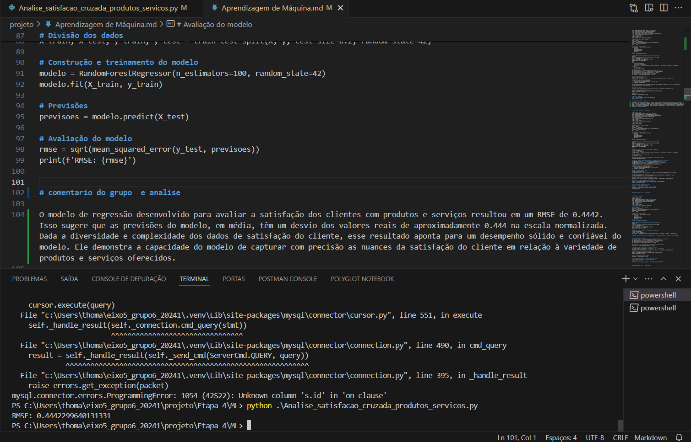

# Machine Learning

Nos scripts apresentados, foram utilizadas técnicas de regressão, classificação e sistemas de recomendação, que são pilares fundamentais do Machine Learning. A eficácia desses métodos varia conforme a complexidade dos dados e o objetivo da análise. O Random Forest é eficaz para prever valores contínuos e capturar complexidades não lineares. O Gradient Boosting Classifier é poderoso para classificação, lidando bem com dados desbalanceados. Já o Nearest Neighbors é ideal para recomendações, pois identifica padrões de consumo similares entre clientes. Cada técnica tem seu método e aplicação específica, demonstrando a versatilidade e o potencial do Machine Learning para fornecer insights valiosos e decisões baseadas em dados. Essas abordagens são fundamentais para transformar grandes volumes de dados em ações estratégicas e personalizadas, impulsionando negócios e melhorando a experiência do cliente.

## Análise de Satisfação Cruzada Entre Produto e Serviço

## O RMSE (Root Mean Square Error)

O RMSE (Root Mean Square Error) é uma métrica que mede a média dos erros ao quadrado entre os valores previstos pelo modelo e os valores reais. A fórmula para calcular o RMSE é:

$$
\text{RMSE} = \sqrt{\frac{1}{n} \sum_{i=1}^{n} (y_i - \hat{y}_i)^2}
$$

onde:

- \( n \) é o número total de observações no conjunto de teste.
- \( y_i \) é o valor real da i-ésima observação.
- \( \hat{y}_i \) é o valor previsto pelo modelo para a i-ésima observação.

Um RMSE baixo indica que o modelo faz previsões que estão, em média, próximas dos valores reais. Isso significa que o modelo tem um bom desempenho.
Um RMSE alto sugere que há uma variação maior entre as previsões do modelo e os valores reais, indicando que o modelo pode não estar capturando bem a complexidade dos dados.

### Comentário do Grupo e Análise

O modelo de regressão desenvolvido para avaliar a satisfação dos clientes com produtos e serviços resultou em um RMSE de 0.4442. Isso sugere que as previsões do modelo, em média, têm um desvio dos valores reais de aproximadamente 0.444 na escala normalizada. Dada a diversidade e complexidade dos dados de satisfação do cliente, esse resultado aponta para um desempenho sólido e confiável do modelo. Ele demonstra a capacidade do modelo de capturar com precisão as nuances da satisfação do cliente em relação à variedade de produtos e serviços oferecidos.

## Previsão de Cancelamento na Agenda

Nesse modelo nós usamos os pilares Accuracy, Macro Average e Weighted Average para identificar o cancelamento da agenda do nosso parceiro (Salão fios de luxo).

- **Accuracy (Acurácia):** A acurácia geral do modelo é de 0.73 ou 73%. Isso significa que, em média, o modelo fez previsões corretas para 73% dos casos no conjunto de teste.

- **Macro Average:** A média macro considera a média aritmética das métricas de precisão, recall e F1-score para cada classe, sem levar em conta o desequilíbrio entre as classes (ou seja, trata todas as classes igualmente). Os valores de 0.30 para precisão, recall e F1-score indicam que o modelo tem um desempenho moderado quando se trata de equilibrar o reconhecimento de todas as classes.

- **Weighted Average:** A média ponderada leva em consideração o desequilíbrio entre as classes, dando mais peso às classes com mais amostras. Os valores de 0.73 para precisão e acurácia, e 0.72 para o F1-score sugerem que o modelo é bastante preciso na classificação das classes majoritárias, mas pode não ser tão eficaz na classificação das classes minoritárias.

### Comentário do Grupo e Análise

O modelo de classificação que desenvolvemos alcançou uma acurácia de 73%, o que indica que ele é capaz de prever corretamente a satisfação dos clientes em três quartos dos casos. No entanto, ao olhar para a média macro, observamos valores em torno de 0.30, refletindo um desempenho moderado na identificação equitativa de todas as categorias de satisfação. A média ponderada, por outro lado, mostra que o modelo é mais eficaz na classificação das categorias com maior número de amostras, com uma precisão e um F1-score de aproximadamente 0.73 e 0.72, respectivamente. Esses resultados sugerem que, enquanto o modelo é confiável para a maioria das previsões, ainda há espaço para melhorias, especialmente na identificação de categorias menos representadas nos dados.

## Previsão de Demanda

### O RMSE (Root Mean Square Error)

O RMSE (Root Mean Square Error) é uma métrica que mede a média dos erros ao quadrado entre os valores previstos pelo modelo e os valores reais. Assim como utilizado para satisfação cruzada do produto, utilizamos o mesmo método para previsão de demanda.

### Comentário do Grupo e Análise

O modelo de regressão florestal aleatória foi desenvolvido para prever os valores pagos pelos serviços com base em dados históricos. Após o treinamento e teste, o modelo alcançou um RMSE de 26.31. O RMSE é uma métrica que mede a média das diferenças ao quadrado entre os valores previstos pelo modelo e os valores reais. Um RMSE de 26.31 significa que, em média, as previsões do modelo desviam-se dos valores reais por aproximadamente 26.31 unidades na mesma escala dos valores pagos.

## Recomendação de Serviço

### KNN (K-Nearest Neighbors)

Sistema de recomendação baseado em KNN (K-Nearest Neighbors) para sugerir serviços aos clientes com base em seus históricos de uso.

### Ponto de Atenção

Devido à lista extensa de recomendação por cliente, fizemos apenas 1 print para evidenciar o resultado.

### Comentário do Grupo e Análise

Nesse modelo, desenvolvemos um sistema de recomendação baseado em KNN (K-Nearest Neighbors) para sugerir serviços aos clientes com base em seus históricos de uso. O sistema identifica padrões de consumo e recomenda serviços que clientes com perfis semelhantes preferiram ou utilizaram frequentemente.
