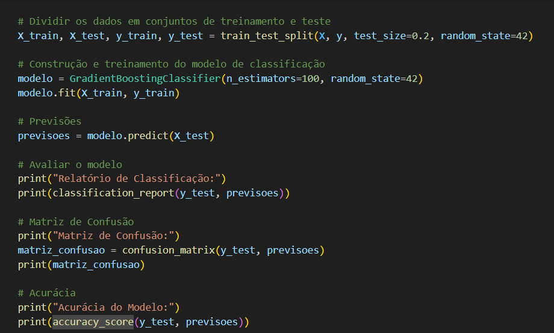

# Resultados de Otimização do Código

- Conexão com Banco de Dados Nossa equipe adotou as melhores práticas de segurança ao carregar as credenciais do banco de dados através de variáveis de ambiente. Essa abordagem protege informações sensíveis e reforça a integridade do nosso sistema.

- Pré-processamento de Dados Implementamos um processo de conversão e criação de novas features baseadas em datas. Esses passos são cruciais para capturar padrões sazonais ou baseados no tempo, permitindo que nosso modelo de Machine Learning aproveite tendências temporais para melhorar suas previsões.

- Normalização,  a normalização dos valores pagos é uma etapa fundamental no uso do algoritmo KNN. Devido à sensibilidade do modelo à escala das features, essa normalização garante que todas as variáveis contribuam igualmente para o resultado final, evitando distorções nos dados.

- Agregação de Dados A agregação de dados e a criação de uma matriz de serviços são etapas que estruturam os dados de maneira eficiente, facilitando o treinamento do modelo. Essa estruturação é essencial para a construção de um sistema de recomendação robusto e confiável.

- Modelo KNN Optamos pelo KNN devido à sua aplicabilidade em sistemas de recomendação.

- Avaliação do Modelo As métricas de avaliação, como acurácia e relatório de classificação, são fundamentais para compreender o desempenho do nosso modelo. Enquanto a acurácia nos dá uma visão geral da eficácia do modelo, a matriz de confusão e o relatório de classificação fornecem insights detalhados sobre o desempenho em cada classe, permitindo-nos identificar áreas específicas para melhoria contínua. 

## Conexão com Banco de Dados

Código na etapa 4 durante o processo de desenvolvimento do ML

Otimização encontrada para todos os códigos que solicitam conexão com o banco

## Pré-processamento de Dados

Esse pré-processamento está em todos os nossos códigos. 

## A normalização dos valores pagos

Exemplo abaixo encontrado no código de Recomendação serviço, mas em todos os códigos foi aplicado a normalização dos valores.

## Agregação de dados 

Exemplo retirado do código de recomendação de serviço, mas em todos os códigos aplicamos a agregração de dados. 

## Modelo KNN 

Exemplo retirado do código de recomendação de serviço

## Avaliação dos modelos

Exemplo retirado do código Previsão de cancelamento e Recomendação de serviço

# Conclusão

Avaliamos que essas otimizações foram suficientes para tornar o projeto mais seguro, mais assertivo e mais alinhado com o nosso propósito. O que outrora era apenas uma maneira simples de análise de dados para orientação do nosso parceiro empreendedor, o Salão Fios de Luxo, agora passa a ser um projeto de Machine Learning e Ciência de Dados. Esse projeto permitirá ao parceiro impulsionar seu negócio com a tecnologia a seu favor. Fios de Luxo passa a ter um parceiro forte chamado ACSB (Análise e Ciência de Dados para Salão de Beleza).